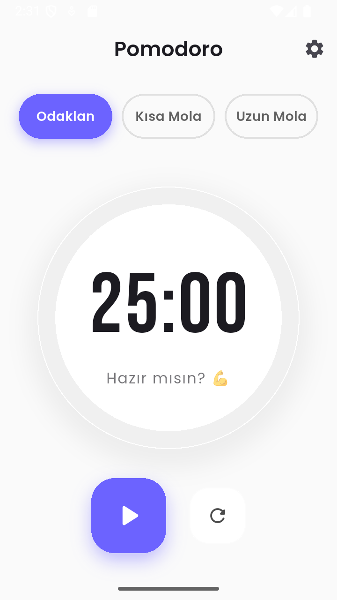
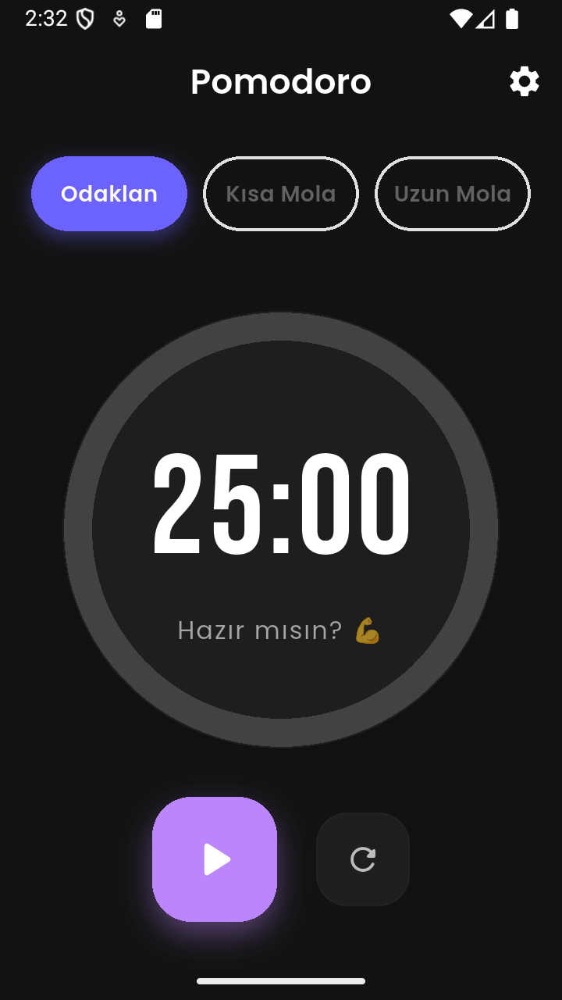

# 🍅 Focus Pomodoro App v1.0

## 🇺🇸 English Description

A modern, feature-rich Pomodoro timer application built with **Flutter**. Designed to boost productivity with a clean UI, customizable settings, and motivational features.

> **[🇹🇷 Türkçe Açıklama için buraya tıklayın / Click here for Turkish version](#tr-readme)**

---

### 📸 Screenshots

|          Home Screen          |             Dark Mode              |               Settings                |
| :---------------------------: | :--------------------------------: | :-----------------------------------: |
|  |  |  |

### ✨ Features

- **⏱️ Smart Timer:** Customizable durations for Focus (25m), Short Break (5m), and Long Break (15m).
- **🎨 Modern UI:** Circular progress indicator with smooth animations and `Google Fonts`.
- **🌙 Dark Mode Support:** Seamless transition between Light and Dark themes.
- **🔊 Custom Sounds:** Choose between Classic Bell, Digital, or Alarm sounds with preview.
- **🌍 Multi-Language:** Full support for **English 🇺🇸** and **Turkish 🇹🇷** (Auto-detects device language).
- **💾 Persistence:** Remembers your preferences (Theme, Sound) using `Shared Preferences`.
- **💬 Motivation:** Displays dynamic motivational quotes to keep you focused.
- **🎉 Celebration:** Confetti animation upon completing a session!

### 🛠️ Tech Stack & Packages

- **Framework:** Flutter & Dart
- **State Management:** [Provider](https://pub.dev/packages/provider)
- **Localization:** [Easy Localization](https://pub.dev/packages/easy_localization)
- **Local Storage:** [Shared Preferences](https://pub.dev/packages/shared_preferences)
- **Audio:** [AudioPlayers](https://pub.dev/packages/audioplayers)
- **UI Effects:** [Confetti](https://pub.dev/packages/confetti), [Google Fonts](https://pub.dev/packages/google_fonts)

---

<h2 id="tr-readme">🇹🇷  Pomodoro Uygulaması v1.0 </h2>

**Flutter** ile geliştirilmiş, modern ve zengin özelliklere sahip bir Pomodoro zamanlayıcı uygulaması. Temiz bir arayüz, özelleştirilebilir ayarlar ve motivasyon artırıcı özelliklerle üretkenliğinizi artırmak için tasarlandı.

### 📸 Ekran Görüntüleri

|             Ana Ekran             |             Karanlık Mod              |               Ayarlar                |
| :-------------------------------: | :-----------------------------------: | :----------------------------------: |
|  |  |  |

### ✨ Özellikler

- **⏱️ Akıllı Zamanlayıcı:** Odaklanma (25dk), Kısa Mola (5dk) ve Uzun Mola (15dk) modları.
- **🎨 Modern Arayüz:** Akıcı animasyonlar ve `Google Fonts` destekli dairesel ilerleme çubuğu.
- **🌙 Karanlık Mod:** Aydınlık ve Karanlık temalar arasında sorunsuz geçiş.
- **🔊 Özel Sesler:** Klasik Zil, Dijital veya Alarm sesleri arasında önizlemeli seçim.
- **🌍 Çoklu Dil Desteği:** **Türkçe 🇹🇷** ve **İngilizce 🇺🇸** desteği (Cihaz dilini otomatik algılar).
- **💾 Kalıcılık (Hafıza):** Uygulamayı kapatsanız bile tercihlerinizi (Tema, Ses) hatırlar.
- **💬 Motivasyon:** Odaklanmanızı sağlayacak dinamik motivasyon sözleri gösterir.
- **🎉 Kutlama:** Oturum tamamlandığında konfeti yağmuru animasyonu!

### 🛠️ Kullanılan Teknolojiler ve Paketler

- **Framework:** Flutter & Dart
- **Durum Yönetimi (State Mng):** Provider
- **Dil Desteği:** Easy Localization
- **Yerel Depolama:** Shared Preferences
- **Ses:** AudioPlayers
- **Görsel Efektler:** Confetti, Google Fonts

## 👤 Geliştirici

**Harun Reşit Mercan**

- GitHub: [@HarunMercan1](https://github.com/HarunMercan1)

---
