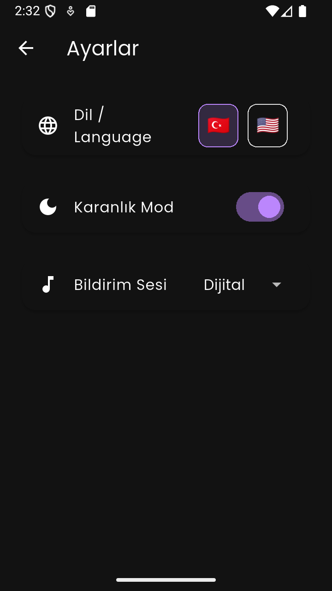

# 🍅 Focus Pomodoro App v1.1

## 🇺🇸 English Description

A modern, feature-rich Pomodoro timer application built with **Flutter**.  
Designed to boost productivity with a clean UI, customizable settings, and motivational features.  
Now featuring a **Premium Splash Screen** experience.

> **[🇹🇷 Türkçe Açıklama için buraya tıklayın](#tr-readme)**

---

## 📸 Screenshots

| Splash Screen                   | Home Screen                         | Settings                              |
| ------------------------------- | ----------------------------------- | ------------------------------------- |
|  |  |  |

---

## ✨ Features

- **⏱️ Smart Timer:** Customizable durations for Focus (25m), Short Break (5m), and Long Break (15m).
- **🎨 Modern UI:** Circular progress indicator with smooth animations and built-in fonts (no internet required).
- **💎 Premium Splash Screen:** Animated opening with ghost-splash effect and developer signature.
- **🌙 Dark Mode Support:** Seamless transition between Light and Dark themes.
- **🔊 Custom Sounds:** Choose between Classic Bell, Digital, or Alarm sounds with preview.
- **🌍 Multi-Language:** English 🇺🇸 and Turkish 🇹🇷 support (auto-detects device language).
- **💾 Persistence:** Saves your preferences (Theme, Sound) using `Shared Preferences`.
- **💬 Motivation:** Dynamic motivational quotes to keep you focused.
- **🎉 Celebration:** Confetti animation when completing a session!
- **👀 Wakelock:** Keeps the screen awake during timer sessions.

---

## 🛠️ Tech Stack & Packages

- **Framework:** Flutter & Dart
- **State Management:** Provider
- **Localization:** Easy Localization
- **Local Storage:** Shared Preferences
- **Audio:** AudioPlayers
- **UI Effects:** Confetti
- **System:** Wakelock Plus, Flutter Native Splash

---

<h2 id="tr-readme">🇹🇷 Pomodoro Uygulaması v1.1</h2>

Flutter ile geliştirilmiş, modern ve zengin özelliklere sahip bir Pomodoro zamanlayıcı uygulaması.  
Temiz arayüz, özelleştirilebilir ayarlar ve motivasyon artırıcı özelliklerle üretkenliğinizi artırmak için tasarlandı.  
v1.1 ile artık **çok daha Premium!**

---

## 📸 Ekran Görüntüleri

| Açılış Ekranı                   | Anasayfa                            | Ayarlar                               |
| ------------------------------- | ----------------------------------- | ------------------------------------- |
|  |  |  |

---

## ✨ Özellikler

- **⏱️ Akıllı Zamanlayıcı:** Odaklanma (25dk), Kısa Mola (5dk), Uzun Mola (15dk).
- **🎨 Modern Arayüz:** Akıcı animasyonlar ve internetsiz çalışan gömülü özel fontlar.
- **💎 Premium Açılış:** Hayalet geçiş efektli imzalı açılış animasyonu.
- **🌙 Karanlık Mod:** Aydınlık/Karanlık temalar arasında sorunsuz geçiş.
- **🔊 Özel Sesler:** Klasik Zil, Dijital veya Alarm sesleri (önizlemeli).
- **🌍 Çoklu Dil Desteği:** Türkçe 🇹🇷 ve İngilizce 🇺🇸 (Cihaz dilini otomatik algılar).
- **💾 Kalıcılık:** Tema ve ses tercihlerini otomatik kaydeder.
- **💬 Motivasyon:** Dinamik motivasyon sözleri.
- **🎉 Kutlama:** Oturum bitince konfeti animasyonu.
- **👀 Uyanık Ekran:** Sayaç çalışırken ekran kapanmaz (Wakelock).

---

## 🛠️ Kullanılan Teknolojiler

- **Framework:** Flutter & Dart
- **Durum Yönetimi:** Provider
- **Dil Desteği:** Easy Localization
- **Yerel Depolama:** Shared Preferences
- **Ses:** AudioPlayers
- **Efekt:** Confetti
- **Sistem:** Wakelock Plus, Flutter Native Splash

---

## 👤 Geliştirici

**Harun Reşit Mercan**  
GitHub: **[@HarunMercan1](https://github.com/HarunMercan1)**
