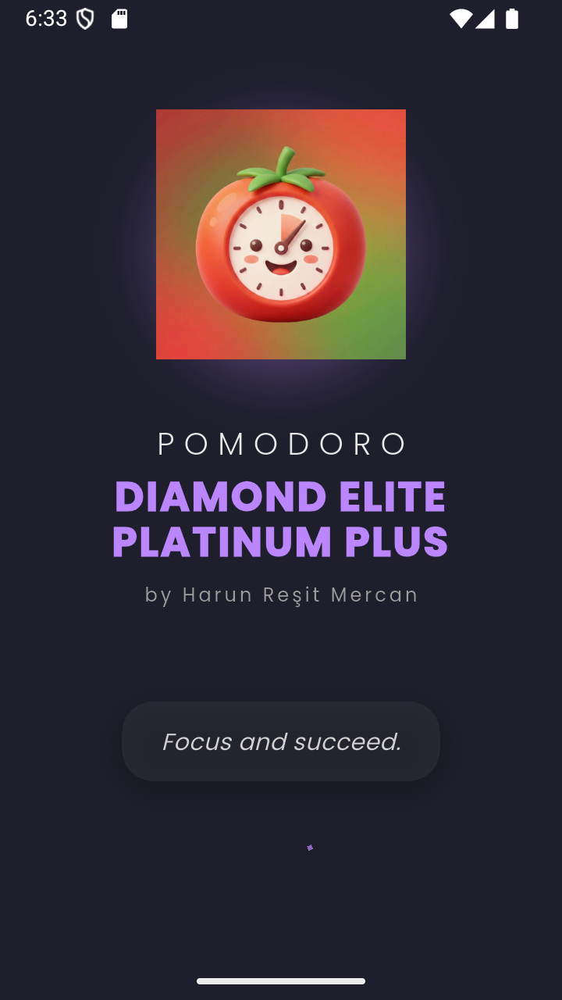
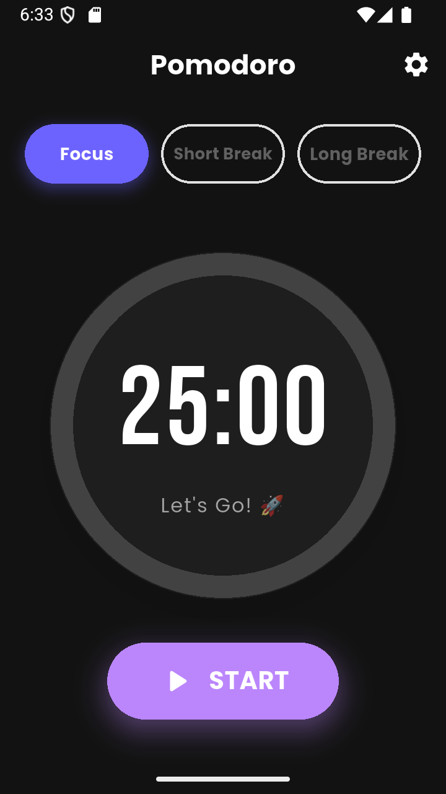
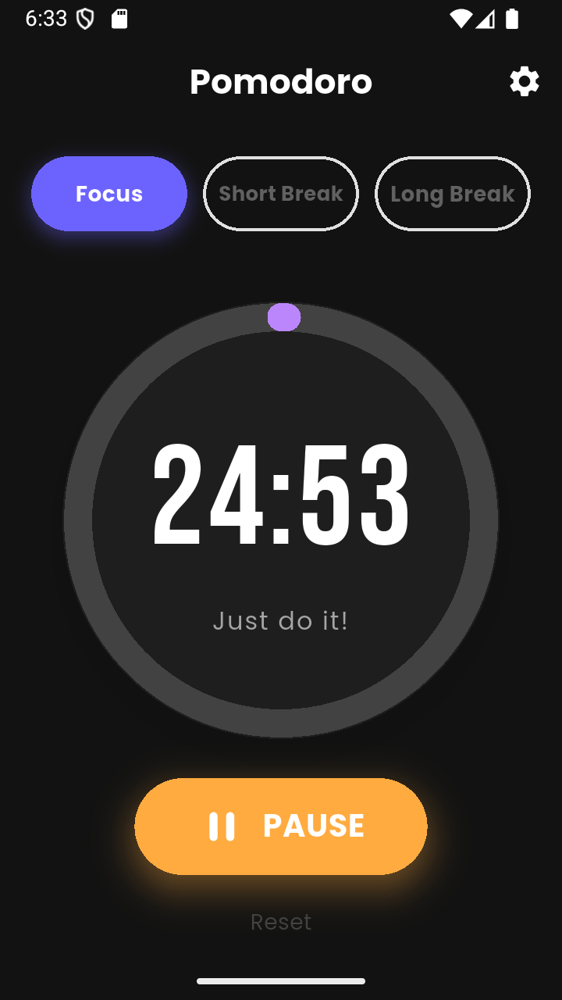
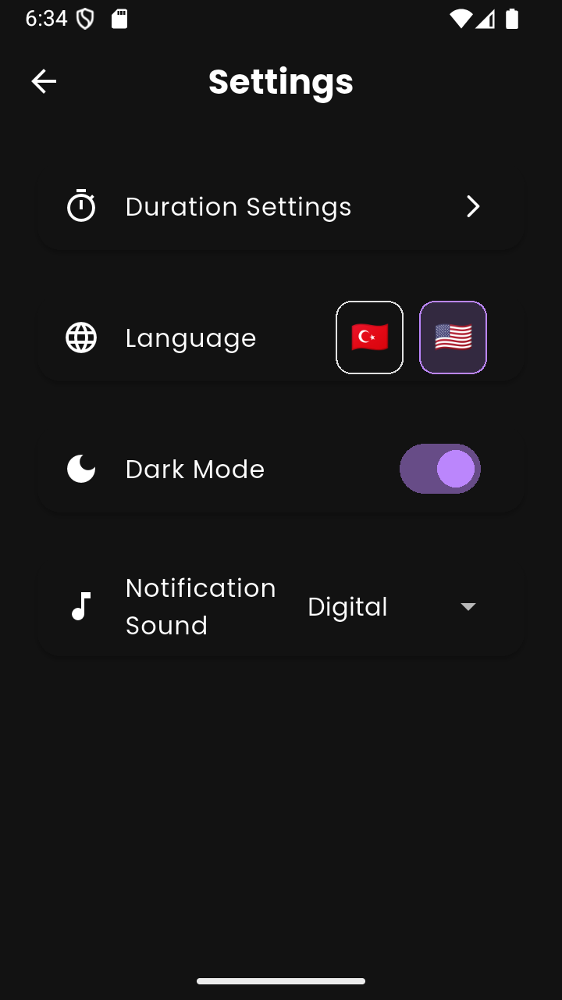
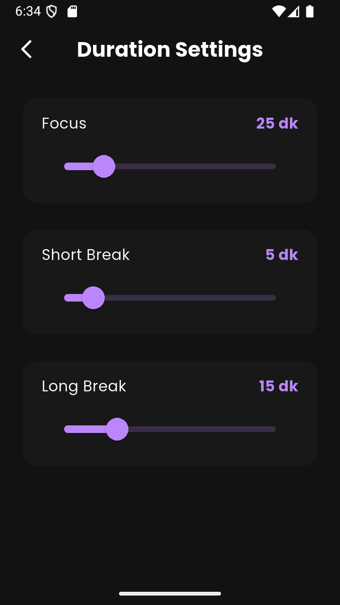

# 🍅 Focus Pomodoro App v1.4

## 🇺🇸 English Description

A modern, feature-rich Pomodoro timer application built with **Flutter**.  
Designed to boost productivity with a clean UI, customizable settings, and motivational features.  
Now featuring **Customizable Durations**, **Background Notifications**, and a **Smart UX**.

> **[🇹🇷 Türkçe Açıklama için buraya tıklayın](#tr-readme)**

---

## 📸 Screenshots

### 📱 App Flow

|             Splash Screen             |                      Home                      |                      Home                       |
| :-----------------------------------: | :--------------------------------------------: | :---------------------------------------------: |
|  |  |  |

### ⚙️ Settings & Customization

|             General Settings              |               Duration Settings (New)               |
| :---------------------------------------: | :-------------------------------------------------: |
|  |  |

---

## ✨ Features (v1.4)

- **⏱️ Fully Customizable Timer:** Adjust Focus, Short Break, and Long Break durations via Settings.
- **🔔 Background Notifications:** Receive alerts and vibrations even when the app is in the background or screen is locked.
- **⏯️ Smart Action Button:** Intuitive Start/Pause/Resume/Finish button with color-coded states and instant response.
- **🎨 Modern UI:** Circular progress indicator with smooth animations and built-in fonts (no internet required).
- **💎 Premium Splash Screen:** Animated opening with ghost-splash effect and developer signature.
- **🌙 Dark Mode Support:** Seamless transition between Light and Dark themes.
- **🔊 Custom Sounds:** Choose between Classic Bell, Digital, or Alarm sounds with preview.
- **🌍 Multi-Language:** English 🇺🇸 and Turkish 🇹🇷 support (auto-detects device language).
- **💾 Persistence:** Saves your preferences (Theme, Sound, Durations) using `Shared Preferences`.
- **💬 Motivation:** Dynamic motivational quotes to keep you focused.
- **🎉 Celebration:** Confetti animation when completing a session!
- **👀 Wakelock:** Keeps the screen awake during timer sessions.

---

## 🛠️ Tech Stack & Packages

- **Framework:** Flutter & Dart
- **State Management:** Provider
- **Localization:** Easy Localization
- **Notifications:** Flutter Local Notifications
- **Local Storage:** Shared Preferences
- **Audio:** AudioPlayers
- **UI Effects:** Confetti
- **System:** Wakelock Plus, Flutter Native Splash, Flutter Launcher Icons

---

<h2 id="tr-readme">🇹🇷 Pomodoro Uygulaması v1.4</h2>

Flutter ile geliştirilmiş, modern ve zengin özelliklere sahip bir Pomodoro zamanlayıcı uygulaması.  
Temiz arayüz, özelleştirilebilir ayarlar ve motivasyon artırıcı özelliklerle üretkenliğinizi artırmak için tasarlandı.  
v1.4 ile artık **Özelleştirilebilir Süreler**, **Bildirimler** ve **Akıllı Buton** özellikleriyle çok daha güçlü!

---

## 📸 Ekran Görüntüleri

### 📱 Uygulama Akışı

|             Açılış Ekranı             |                    Anasayfa                    |                    Anasayfa                     |
| :-----------------------------------: | :--------------------------------------------: | :---------------------------------------------: |
|  |  |  |

### ⚙️ Ayarlar ve Özelleştirme

|               Genel Ayarlar               |                Süre Ayarları (Yeni)                 |
| :---------------------------------------: | :-------------------------------------------------: |
|  |  |

---

## ✨ Özellikler (v1.4)

- **⏱️ Özelleştirilebilir Süre:** Odaklanma, Kısa Mola ve Uzun Mola sürelerini ayarlardan dilediğiniz gibi değiştirin.
- **🔔 Arka Plan Bildirimleri:** Uygulama kapalıyken veya ekran kilitliyken sesli ve titreşimli bildirim alın.
- **⏯️ Akıllı Aksiyon Butonu:** Renk değiştiren, anlık tepki veren ve akıllı durum yönetimine (Başlat/Duraklat/Devam Et/Bitir) sahip ana buton.
- **🎨 Modern Arayüz:** Akıcı animasyonlar ve internetsiz çalışan gömülü özel fontlar.
- **💎 Premium Açılış:** Hayalet geçiş efektli imzalı açılış animasyonu.
- **🌙 Karanlık Mod:** Aydınlık/Karanlık temalar arasında sorunsuz geçiş.
- **🔊 Özel Sesler:** Klasik Zil, Dijital veya Alarm sesleri (önizlemeli).
- **🌍 Çoklu Dil Desteği:** Türkçe 🇹🇷 ve İngilizce 🇺🇸 (Cihaz dilini otomatik algılar).
- **💾 Kalıcılık:** Tema, ses ve süre tercihlerini otomatik kaydeder.
- **💬 Motivasyon:** Dinamik motivasyon sözleri.
- **🎉 Kutlama:** Oturum bitince konfeti animasyonu.
- **👀 Uyanık Ekran:** Sayaç çalışırken ekran kapanmaz (Wakelock).

---

## 🛠️ Kullanılan Teknolojiler

- **Framework:** Flutter & Dart
- **Durum Yönetimi:** Provider
- **Dil Desteği:** Easy Localization
- **Bildirimler:** Flutter Local Notifications
- **Yerel Depolama:** Shared Preferences
- **Ses:** AudioPlayers
- **Efekt:** Confetti
- **Sistem:** Wakelock Plus, Flutter Native Splash, Flutter Launcher Icons

---

## 👤 Geliştirici

**Harun Reşit Mercan** GitHub: **[@HarunMercan1](https://github.com/HarunMercan1)**
